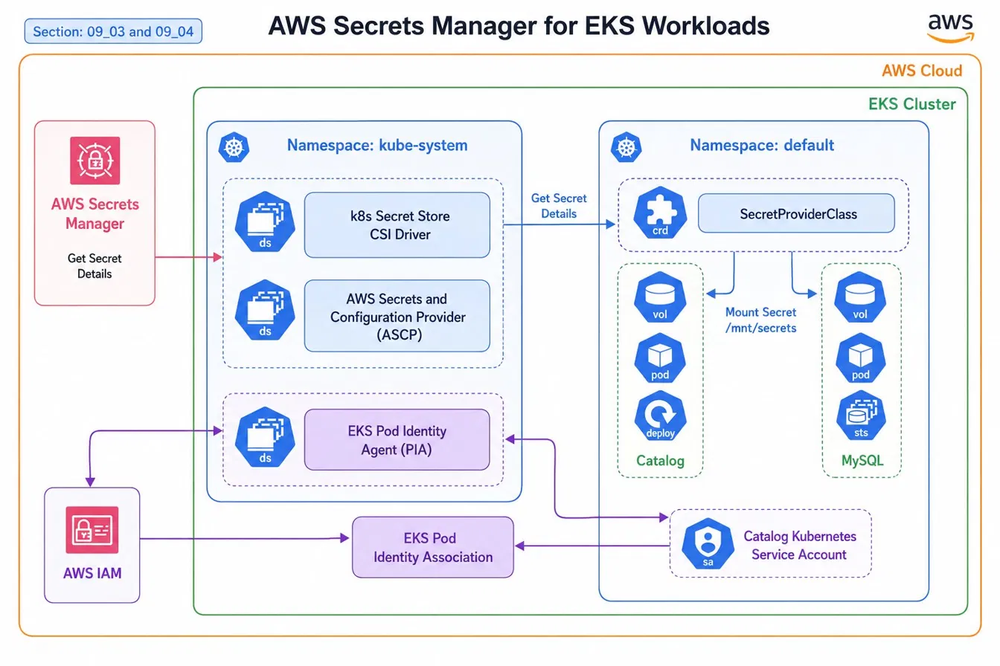

# EKS Workload Security with AWS Secrets Manager

> Deploying a containerized retail catalog service on Amazon EKS — then hardening it with AWS Secrets Manager, the Secrets Store CSI Driver, and EKS Pod Identity so that zero plaintext credentials ever touch the cluster.

---

## What This Project Demonstrates

This project has two distinct phases, each building on the last:

**Phase 1 — Kubernetes Fundamentals**
Standing up a production-style microservice topology on EKS: a stateless catalog API backed by a MySQL StatefulSet, wired together with ClusterIP services, a headless DNS service, a ConfigMap, and a dedicated ServiceAccount — all following Kubernetes best practices for separation of concerns.

**Phase 2 — Secrets Security Hardening**
Replacing every plaintext credential with a secure, auditable secrets pipeline: AWS Secrets Manager → Secrets Store CSI Driver (SSCD) → volume mount → environment variable injection at pod startup. No secrets in YAML. No secrets in etcd. No secrets in container image layers.

---

## Architecture



The diagram above maps to the full architecture shown in the project diagram (`EKS_Project_diagram_2.png`). The flow is intentional: IAM trust stays outside the cluster, secret values never travel as environment variables set at the Kubernetes layer, and the CSI driver handles rotation automatically.

---

## Project Structure

```
.
├── 01_catalog_deployment.yaml          # Catalog API — Deployment
├── 02_catalog_clusterip_service.yaml   # Catalog API — internal ClusterIP Service
├── 03_catalog_configmap.yaml           # Non-sensitive config (DB endpoint, name, timeout)
├── 04_catalog_statefulset.yaml         # MySQL — StatefulSet with stable DNS identity
├── 05_catalog_mysql_headless_service.yaml  # MySQL — headless Service for StatefulSet DNS
├── 06_catalog_mysql_service_account.yaml   # Shared Kubernetes ServiceAccount
├── 01-catalog-secretproviderclass.yaml    # SecretProviderClass CRD (SSCD ↔ ASM bridge)
├── catalog-db-secret-policy.json          # IAM policy granting GetSecretValue on the secret
└── trust-policy.json                      # IAM trust policy for EKS Pod Identity
```

---

## Phase 1: Kubernetes Fundamentals

### Deployment (`01_catalog_deployment.yaml`)
- **Rolling update strategy** with `maxUnavailable: 1` for zero-downtime deploys
- **Hardened security context**: drops all Linux capabilities, enforces read-only root filesystem, runs as non-root UID 1000
- **Health gates**: both `readinessProbe` and `livenessProbe` hit `/health` on port 8080
- **Resource limits** defined on both CPU and memory — required for Kubernetes scheduler decisions
- Secrets injected at startup via shell wrapper reading from the CSI volume mount (see Phase 2)

### StatefulSet (`04_catalog_statefulset.yaml`)
- Manages the MySQL instance with a **stable network identity** (`catalog-mysql-0`)
- The headless service (`05_catalog_mysql_headless_service.yaml`) enables DNS-based discovery at the predictable address `catalog-mysql-0.catalog-mysql.default.svc.cluster.local:3306` — referenced directly in the ConfigMap
- Data volume backed by `emptyDir` (appropriate for this lab context)

### ConfigMap (`03_catalog_configmap.yaml`)
- Holds **only non-sensitive** configuration: DB provider, endpoint, database name, and connect timeout
- Credentials (`RETAIL_CATALOG_PERSISTENCE_USER`, `RETAIL_CATALOG_PERSISTENCE_PASSWORD`) are intentionally **commented out** — they come from Secrets Manager instead

### Services
- `catalog-service` (ClusterIP) routes internal traffic to the catalog pods on port 8080
- `catalog-mysql` (headless, `clusterIP: None`) provides stable DNS for the StatefulSet without load balancing — correct for databases where clients need to target a specific pod

### ServiceAccount (`06_catalog_mysql_service_account.yaml`)
- A single `catalog-mysql-sa` ServiceAccount is shared across both the Catalog Deployment and MySQL StatefulSet
- This is the identity anchor for EKS Pod Identity in Phase 2

---

## Phase 2: Secrets Security Hardening

### The Problem Being Solved

Kubernetes Secrets are base64-encoded, stored in etcd, and easily decoded. Committing credentials to YAML files — even `Secret` manifests — creates audit and rotation challenges. This phase eliminates plaintext credentials entirely from the cluster.

### How It Works

**1. Secret stored in AWS Secrets Manager**

The secret `catalog-db-secret-1` is a JSON object containing `MYSQL_USER` and `MYSQL_PASSWORD`. Stored, versioned, and auditable in AWS.

**2. IAM policy grants access (`catalog-db-secret-policy.json`)**

```json
{
  "Action": ["secretsmanager:GetSecretValue", "secretsmanager:DescribeSecret"],
  "Resource": "arn:aws:secretsmanager:us-east-2:...:secret:catalog-db-secret*"
}
```

Scoped to the specific secret ARN with a wildcard suffix to accommodate version suffixes — least-privilege by design.

**3. EKS Pod Identity trust policy (`trust-policy.json`)**

```json
{
  "Principal": { "Service": "pods.eks.amazonaws.com" },
  "Action": ["sts:AssumeRole", "sts:TagSession"]
}
```

The trust policy allows the EKS Pod Identity service (not IRSA) to assume the IAM role on behalf of pods — a newer, simpler credential chain that doesn't require annotating ServiceAccounts with OIDC ARNs.

**4. SecretProviderClass bridges Kubernetes and AWS (`01-catalog-secretproviderclass.yaml`)**

```yaml
provider: aws
parameters:
  objects: |
    - objectName: "catalog-db-secret-1"
      objectType: "secretsmanager"
      jmesPath:
        - path: "MYSQL_USER"
          objectAlias: "MYSQL_USER"
        - path: "MYSQL_PASSWORD"
          objectAlias: "MYSQL_PASSWORD"
  usePodIdentity: "true"
```

The `jmesPath` extraction pulls individual keys out of the JSON secret and surfaces them as separate files in the volume mount. `usePodIdentity: "true"` tells the ASCP provider to use EKS Pod Identity rather than IRSA.

**5. Pods read secrets from the filesystem, not environment variables**

Both the Catalog Deployment and MySQL StatefulSet use this pattern at container startup:

```bash
export RETAIL_CATALOG_PERSISTENCE_USER=$(cat /mnt/secrets-store/MYSQL_USER)
export RETAIL_CATALOG_PERSISTENCE_PASSWORD=$(cat /mnt/secrets-store/MYSQL_PASSWORD)
exec java -jar /app/catalog.jar   # or mysqld
```

The secret files are mounted read-only via the CSI volume. They are never set as static environment variables in the pod spec — meaning they don't appear in `kubectl describe pod` output and aren't stored in etcd.

---

## Key Technical Decisions

| Decision | Rationale |
|---|---|
| EKS Pod Identity over IRSA | Simpler trust chain — no OIDC provider annotation required on the ServiceAccount; association is managed at the EKS level |
| CSI volume mount over Kubernetes Secrets | Values never touch etcd; the CSI driver can sync rotation from Secrets Manager without pod restarts |
| JMESPath key extraction | Avoids the anti-pattern of a single secret file containing JSON that application code must parse |
| Headless service for MySQL StatefulSet | StatefulSets require stable DNS per-pod identity; ClusterIP load balancing would be incorrect here |
| Shared ServiceAccount | Both workloads need the same Secrets Manager access; a single SA keeps the Pod Identity association clean |
| Non-root, read-only filesystem on catalog container | Defense-in-depth — compromised process cannot write to the filesystem or escalate via capabilities |

---

## Skills Demonstrated

- **Amazon EKS** — cluster workload deployment, namespace organization, pod scheduling
- **Kubernetes** — Deployments, StatefulSets, Services (ClusterIP + headless), ConfigMaps, ServiceAccounts, CRDs
- **AWS Secrets Manager** — secret creation, JSON structured secrets, JMESPath extraction
- **Secrets Store CSI Driver + ASCP** — DaemonSet-based secret injection without Kubernetes Secrets
- **EKS Pod Identity** — IAM role association to Kubernetes workloads without OIDC annotation complexity
- **AWS IAM** — least-privilege policy scoping, trust policy authoring
- **Kubernetes security hardening** — securityContext, capability dropping, read-only root filesystem, non-root execution

---

*Part of an ongoing portfolio documenting hands-on AWS and Kubernetes engineering. Built and documented by Emanuel Pruitt.*